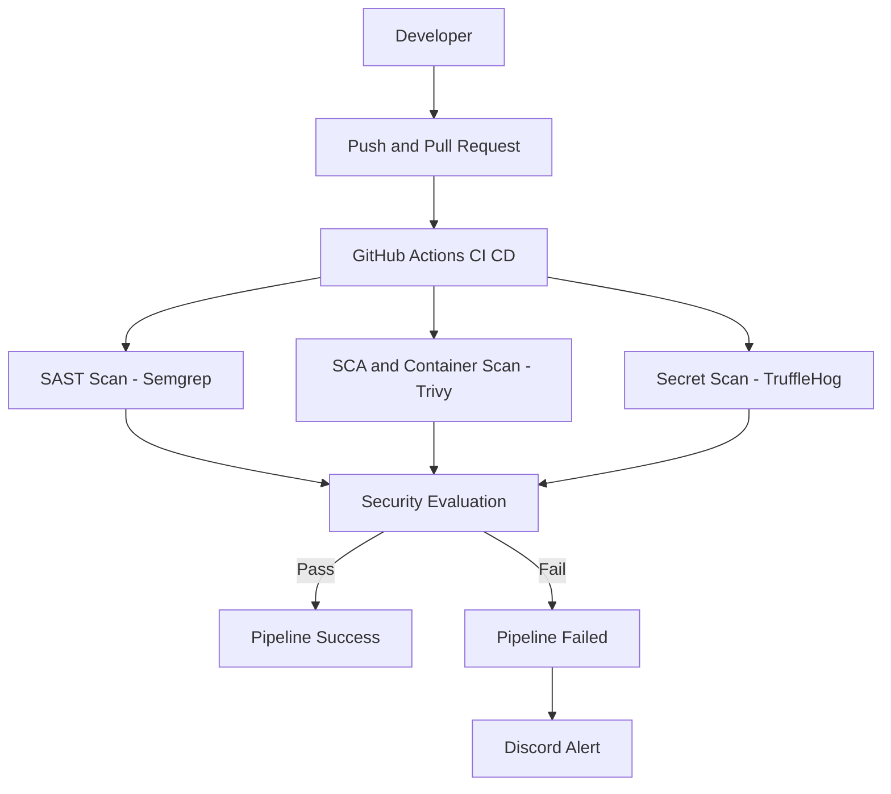

# DevSecOps CI/CD Security Pipeline

 Automated security testing using GitHub Actions — implementing **Shift-Left Security**

---

## Overview

This project demonstrates a **real-world DevSecOps CI/CD pipeline** that integrates security directly into the software development lifecycle.

It uses a **deliberately vulnerable Node.js/Express application** to simulate real-world vulnerabilities and detect them automatically during CI/CD execution.

Every **push** and **pull request** triggers automated security scans to ensure vulnerabilities are identified early.

> ⚠️ **Warning:** This application contains intentional vulnerabilities (OWASP Top 10) for educational purposes.  
> **Do NOT deploy in production.**

---

## Key Highlights

-  Fully automated **CI/CD security pipeline**
-  Implements **Shift-Left Security**
-  Detects vulnerabilities **before deployment**
-  Simulates **SOC alerting workflow**
-  Uses industry-standard security tools

---

## Pipeline Architecture


## Security Toolchain

### 1. Static Application Security Testing (SAST)

- **Tool:** Semgrep  
- **Workflow:** `semgrep-sast.yml`  
- **Purpose:** Analyze source code for vulnerabilities  

**Findings:**
- SQL Injection  
- OS Command Injection  

---

### 2. Software Composition Analysis (SCA) & Container Scanning

- **Tool:** Trivy  
- **Workflow:** `trivy-sca.yml`  
- **Purpose:**
  - Scan dependencies for CVEs  
  - Scan Docker images for OS vulnerabilities  

**Findings:**
- Vulnerable dependencies (`express`, `lodash`)  
- Outdated Docker base image (`node:14-alpine`)  

---

### 3. Secret Scanning

- **Tool:** TruffleHog  
- **Workflow:** `secret-scanning.yml`  
- **Purpose:** Detect exposed secrets in codebase and history  

**Findings:**
- Hardcoded AWS keys  
- Database credentials  

---

### 4. Automated Alerting System

- **Tool:** Discord Webhook  
- **Action:** `Ilshidur/action-discord`  

**Purpose:**
- Fail pipeline on critical vulnerabilities  
- Send real-time alerts to a Discord channel  

---

## Setup Instructions

### 1️⃣ Configure Discord Webhook

1. Go to: **Discord → Server Settings → Integrations → Webhooks**
   
3. Create a webhook and copy the URL  

4. Add it to GitHub:**Settings → Secrets and variables → Actions**
  
5. Create a new secret:
   #### Name: DISCORD_WEBHOOK
   #### Value: your_webhook_url

### 2️⃣ Run the Pipelines

1. Fork or clone this repository
```bash
git clone https://github.com/nithin-santhosh/DevSecOps-ci-cd-scanner.git
cd DevSecOps-ci-cd-scanner
```
2. Trigger the Pipeline

  The CI/CD workflows are automatically triggered on:

  - Push events
  - Pull Requests

  To trigger manually:

  - Make a small code change
  - Commit and push to the repository
``` 
git add .
git commit -m "Trigger CI/CD pipeline"
git push
```
3. Monitor Workflow Execution
   
   Go to the **Actions tab** in your repository:
   
   Select a workflow run:
   - Semgrep SAST
   - Trivy Scan
   - Secret Scanning
  
    Click on a job to view detailed logs and findings

5. Analyze Results

    During execution, the pipeline will:
  
   - Identify vulnerabilities in code and dependencies
   - Detect exposed secrets
   - Evaluate severity levels

    Outcomes:
   
   - Pass → No critical vulnerabilities found
   - Fail → Critical issues detected → Alert triggered

5. View Alerts (Optional)

   If configured, failed pipelines will:
   - Send real-time alerts via Discord Webhook
   - Simulate a SOC incident response workflow

6. Tip

   To test detection capabilities:
   - Introduce a dummy API key
   - Use vulnerable dependencies
   - Add unsafe code patterns

   Then push changes to observe how each tool reacts.
---

## Example Findings

| Tool        | Example Issue |
|------------|-------------|
| Semgrep     | Unsafe SQL queries |
| Trivy       | Vulnerable dependencies (CVEs) |
| TruffleHog  | Exposed API keys |

---

## Why This Project Matters

Traditional security practices often occur late in development, increasing risk and cost.

This project demonstrates how DevSecOps:

- Integrates security into CI/CD pipelines  
- Detects vulnerabilities early  
- Reduces remediation cost  
- Improves overall application security  

---

## Future Enhancements

- Add **DAST (Dynamic Application Security Testing)**  
- Integrate **SIEM (Wazuh / Splunk)**  
- Add **Slack / Email alerts**  
- Implement **Policy-as-Code (OPA)**  
- Build a vulnerability dashboard  

---


## Support

If you found this project useful, consider giving it a ⭐ on GitHub!
